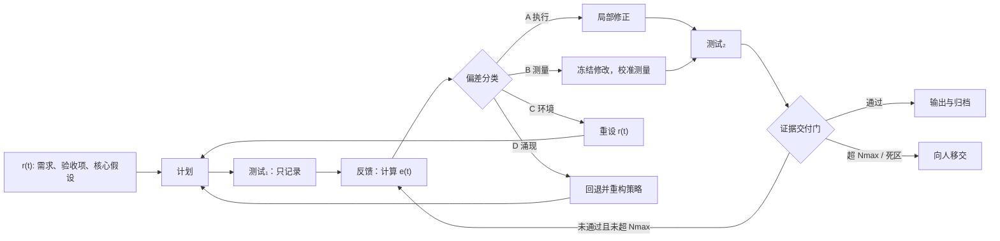

# Project Cybersyn — 面向 AI Agent 的分级闭环控制 Skill

> **Evidence-first hierarchical closed-loop control for AI agents**
> 不赌一次规划完美，而是用可验证证据、反馈和受控升级完成迭代自校正。

[](LICENSE)
[](docs/LICENSE-CC-BY.md)
[](https://github.com/dimensionlesslu-dotcom/project_sybersyn/actions/workflows/smoke-test.yml)


Project Cybersyn 把控制论、系统论和软件验证原则转写为 Agent 可执行的任务协议：先按复杂度选择控制强度，再执行“计划—测量—反馈—修正—复测—交付”闭环。每个需求必须有独立证据；没有证据、测量不可靠或目标已经漂移时，不允许靠模板预测宣称完成。

本仓库同时包含开发源码、评测材料和可安装 Skill 包。实际安装目录是 [`project-cybersyn/`](project-cybersyn/)，而不是整个研究仓库。

## 当前 Proposal / Current Proposal

### 1. 分级控制，而不是所有任务走同一套重流程

| 层级 | 判定 | 默认策略 |
| --- | --- | --- |
| L1 | 单文件或单模块、目标明确、无跨模块依赖 | 一句计划、直接修改、相关测试；不建状态，不启 subagent |
| L2 | 大量同质修改、批量验证 | 单 Agent 流程，加批量 smoke/unit/integration 检查 |
| L3 | 异构模块互相依赖，或需求含隐含假设 | 完整证据闭环；按审计门决定是否启用只读审计员 |
| L4 | 目标、资源或环境持续变化 | 显式假设、环境复核、多方案讨论和人工决策 |

L3/L4 会先尝试拆成可独立验收的 L1/L2 子任务；只有接口、目标或假设之间的冲突无法局部化时，才升级控制强度。

### 2. 主闭环



核心状态：

- `r(t)`：用户需求、验收清单、约束和核心假设。
- `y(t)`：当前真实产物，包括 diff、命令输出和测试结果。
- `e(t)`：需求与产物之间的缺失、多余、错误和回归。
- `u(t)`：本轮干预，如小修、局部重写、重构或停止。
- `RequirementEvidence`：逐项记录 `passed | failed | unverified | blocked` 和可定位证据。

### 3. 四类偏差

| 类型 | 控制论解释 | Agent 场景 | 响应 |
| --- | --- | --- | --- |
| A 执行偏差 | 控制动作或执行器未达到目标 | 方向正确，代码细节未达标 | 调整实现强度 `k` |
| B 测量偏差 | 传感器、观测或验证模型不可靠 | 测试不稳定、证据不可重复 | 冻结修改，先校准验证 |
| C 环境漂移 | 设定值、外部约束或扰动分布变化 | 用户需求、版本、资源已改变 | 暂停并重设 `r(t)` |
| D 涌现偏差 | 内部模型遗漏跨组件耦合 | 模块单测通过、集成失败 | 回退一层，重构策略或接口 |

### 4. 证据优先的交付门

模板、关键词命中和“看起来正确”都不是证据。交付必须满足：

1. 每个 requirement 都有独立 ledger 项；
2. 每项状态均为 `passed`；
3. 证据可定位到测试、检查、来源或用户确认；
4. 没有 `unverified`、阻塞性偏差和 high/medium 残留；
5. 外部环境与最近一次确认的核心假设仍有效。

### 5. 审计默认关闭，以用户意图和增量成本为门

没有明确审计请求，也没有用户声明的预算时，默认只运行当前 Agent 的 smoke、相关 unit/integration、lint、type-check 和证据核对，不启动审计 subagent，也不组装多角度 PromptPacket。

自动多角度审计必须同时满足：

- 用户声明预算；
- 宿主提供有效且当前的价格记录；
- 预计增量总成本不超过预算；
- 任务不是普通 L1；
- subagent 调用数和上下文不超过上限。

用户明确提出“审计、交叉验证、红队、多角度、独立复核、派 subagent”等意图时，可以启用对应只读审计，但仍受用户预算、调用上限和权限边界约束。

### 6. 有界开源复用扫描

在需求、约束和非目标明确后，greenfield、L3/L4 或通用基础能力任务会在用户允许联网时先执行有界复用扫描：最多保留 3–5 个候选，按功能、许可证、安全性、维护状态和集成总成本比较，最终选择 `adopt | wrap | fork | reference | build`。

L1、局部修复、离线任务和高度专有需求默认跳过。搜索与比较不等于授权安装或执行第三方代码。

## 数学模型 / Mathematical Model

Project Cybersyn 更接近**离散、混合、部分可观测的任务控制器**，而不是线性时不变的物理控制系统。下面的数学表达用于澄清结构和决策边界；除特别说明外，不声称构成严格稳定性证明。

### 1. 状态、观测、偏差与控制

用离散轮次 `t` 表示迭代：

$$
x_{t+1}=f(x_t,u_t,d_t), \qquad y_t=h(x_t)+v_t
$$

其中：

- $x_t$ 是任务的真实但不完全可见状态；
- $u_t$ 是 Agent 的修改、校准、重构或停止动作；
- $d_t$ 是需求变化、依赖升级等外部扰动；
- $y_t$ 是测试、检查和文件产物形成的观测；
- $v_t$ 是测量噪声、偶发测试和错误解释。

任务偏差写作：

$$
e_t = r_t \ominus y_t
$$

$\ominus$ 不是普通向量减法，而是需求集合与证据化产物之间的结构差：缺失、多余、错误、未验证和约束冲突。

控制策略为：

$$
u_t=\pi(e_t,x_t,\mathcal E_t,B_t)
$$

其中 $\mathcal E_t$ 是证据账本，$B_t$ 是预算与权限边界。相同的表面误差可能来自 A/B/C/D 四种机制，因此不能只按误差大小调参。

### 2. 经典闭环公式与适用边界

对线性负反馈系统，闭环传递函数常写为：

$$
T(s)=\frac{G(s)}{1+G(s)H(s)}
$$

它说明反馈会改变系统的增益、动态与稳定性。但 Agent 任务通常是离散、非线性、带符号约束的系统，所以 Project Cybersyn 只借用“输出反馈影响下一轮控制”的结构，不把这个公式直接用于计算任务收敛。

### 3. 证据收敛是逻辑谓词

令 requirement 集合为 $\mathcal R$，阻塞残留集合为 $\mathcal D_b$。交付条件定义为：

$$
\operatorname{Deliver}(t)=1
\iff
\left(\forall r_i\in\mathcal R,\;status_i=passed\right)
\land |\mathcal D_b|=0
\land A_t
\land C_t
$$

$A_t$ 表示核心假设仍有效，$C_t$ 表示环境约束仍兼容。这是可执行的验收谓词，不是概率置信度。

### 4. 偏差能量与增益：Lyapunov 启发，而非 Lyapunov 证明

工具用严重度加权的离散偏差能量描述趋势：

$$
E_t=8N_{critical}+4N_{high}+2N_{medium}+N_{low}
$$

一次干预的经验增益为：

$$
g_t=\frac{|E_{t-1}-E_t|}{k_t}
$$

$k_t$ 是干预强度的离散等级。连续多轮 $E_t$ 不下降、增益很低或在窄区间振荡，只能作为触发二阶审计或换策略的信号。因为没有证明正定性、系统动力学和 $\Delta E<0$ 的充分条件，README 和代码都把它标为 **Lyapunov-inspired heuristic**，不能声称系统获得了经典意义上的渐近稳定性。

### 5. 必要多样性与多角度审计

Ashby 用“多样性”表示系统可区分状态的数量；有限状态下可写为：

$$
V(X)=\log_2|X|
$$

控制器必须拥有足够的响应多样性，才能吸收任务扰动的相关多样性。Project Cybersyn 的工程映射是：A/B/C/D 不能共用一种修复策略，复杂耦合任务需要不同结构的观察视角。但更多 subagent 不自动等于更多有效信息。

若新审计视角 $F_{new}$ 在已有证据 $Z$ 与既有审计 $F_{old}$ 条件下没有新增信息：

$$
I(F_{new};\,Outcome\mid Z,F_{old})\approx0
$$

那么它主要增加成本和重复意见。这正是多角度审计保持 opt-in、等待真实前向评测的原因。

### 6. 审计成本门

预计增量成本：

$$
C_{audit}=\sum_j
\left(
N^{in}_j p^{in}_j+N^{out}_j p^{out}_j+C^{tool}_j
\right)
$$

只有当用户显式要求审计，或 $C_{audit}$ 在用户声明预算内且调用/上下文上限均满足时，才允许扩大审计。单价低不代表总成本低，因此单价门不能替代 Token 数量与调用次数上限。

### 7. 复用决策的总拥有成本

对候选实现 $j$，使用下面的工程成本分解：

$$
TCO_j=C_{integration}+C_{license}+C_{security}+C_{maintenance}+C_{runtime}+C_{exit}
$$

在功能和约束满足的候选中选择最低可接受 TCO，而不是按 Star 数或流行度决策。`wrap` 经常优于直接 `adopt`，因为它保留了退出和替换路径。

## 学术原理与工程映射 / Academic Foundations

| 学术来源 | 原理 | 在 Project Cybersyn 中的映射 | 边界 |
| --- | --- | --- | --- |
| Norbert Wiener, *Cybernetics* | 反馈、通信与控制 | 测试输出进入下一轮计划和修改 | Agent 任务不是物理伺服系统 |
| W. Ross Ashby, *An Introduction to Cybernetics* | 必要多样性、状态与调节 | 四类偏差、策略多样性、L1–L4 分级 | 多样性不是“多派 Agent”本身 |
| Conant & Ashby, Good Regulator theorem | 有效调节器需要系统内部模型 | `r(t)`、假设集、环境模型和复用扫描 | 内部模型必须持续由证据校正 |
| Claude Shannon, information theory | 熵、噪声、信道与新增信息 | 测量质量、独立审计、避免重复视角 | 目前未把自然语言 Finding 校准成概率分布 |
| R. E. Kalman, state estimation | 从带噪观测估计不可见状态 | B 类测量偏差、校准测试与证据质量 | 当前不是数值 Kalman filter |
| Heinz von Foerster, second-order cybernetics | 把观察者纳入被审视系统 | assumption-auditor 质疑目标、测量与自身偏见 | 审计仍受宿主权限和证据限制 |
| Stafford Beer, Viable System Model | 运行、协调、控制、环境与政策的递归组织 | L4 讨论厅、环境复核、向人移交 | VSM 按需加载，不强加给 L1/L2 |
| Lyapunov stability tradition | 用标量函数研究动态系统稳定性 | 偏差能量与振荡检测 | 仅启发式监控，不是稳定性定理 |

### 主要文献 / Primary and Publisher Sources

1. Norbert Wiener, *Cybernetics: Or Control and Communication in the Animal and the Machine*, 1948. [MIT Press edition](https://mitpress.mit.edu/9780262537841/cybernetics-or-control-and-communication-in-the-animal-and-the-machine/).
2. W. Ross Ashby, *An Introduction to Cybernetics*, 1956. [W. Ross Ashby Digital Archive PDF](https://ashby.info/Ashby-Introduction-to-Cybernetics.pdf).
3. Roger C. Conant and W. Ross Ashby, “Every Good Regulator of a System Must Be a Model of That System,” 1970. [DOI: 10.1080/00207727008920220](https://doi.org/10.1080/00207727008920220).
4. Claude E. Shannon, “A Mathematical Theory of Communication,” 1948. [DOI: 10.1002/j.1538-7305.1948.tb01338.x](https://doi.org/10.1002/j.1538-7305.1948.tb01338.x).
5. R. E. Kalman, “A New Approach to Linear Filtering and Prediction Problems,” 1960. [DOI: 10.1115/1.3662552](https://doi.org/10.1115/1.3662552).
6. Heinz von Foerster et al., *Cybernetics of Cybernetics*, Biological Computer Laboratory, 1974. [ERIC archive](https://files.eric.ed.gov/fulltext/ED120147.pdf).
7. Stafford Beer, *Brain of the Firm*. [Wiley publisher page](https://www.wiley-vch.de/en?isbn=9780471948391&option=com_eshop&view=product).

更完整的学术脉络见 [`docs/theory.md`](docs/theory.md) 和 [`docs/references.md`](docs/references.md)。

## 快速开始 / Quick Start

```bash
git clone https://github.com/dimensionlesslu-dotcom/project_sybersyn.git
cd project_sybersyn
python quick_validate.py project-cybersyn
python -m unittest discover -s tests -v
python tools/smoke_test.py
```

将 [`project-cybersyn/`](project-cybersyn/) 复制或安装到宿主的 Skill 目录。开发仓库中的 `evals/`、`tests/` 和改进计划不属于最小安装包。

示例调用：

```powershell
python project-cybersyn/tools/cybersyn_state.py init `
  --level L3 `
  --task "refactor auth" `
  --requirements "@project-cybersyn/examples/requirements.json"
```

完整运行方式见 [`project-cybersyn/tools/README.md`](project-cybersyn/tools/README.md) 和 [`project-cybersyn/examples/`](project-cybersyn/examples/)。

## 评测状态 / Evaluation Status

- 30 个案例，覆盖 L1–L4 和对抗边界。
- 5 个变体，共 150 条 `static-contract` observations。
- CI 的 `contract-only` 模式验证安全契约、rubric 和安装包一致性。
- 静态契约数据不是 Agent 真实性能数据；当前缺少 `task_completion_rate`、`user_interruptions`、`total_rounds` 等 outcome 指标。
- 因此多角度审计保持 opt-in，不能仅凭静态数据宣称默认开启具有净收益。

## 仓库结构 / Repository Structure

```text
project_sybersyn/
├── SKILL.md / SKILL.en.md          # 开发源 Skill
├── project-cybersyn/               # 可安装的最小 Skill 包
│   ├── agents/                     # UI 元数据与只读审计员
│   ├── examples/                   # L1/L3 与证据 fixtures
│   ├── references/                 # 独立验证协议
│   └── tools/                      # 纯标准库运行工具
├── tools/                          # 开发源工具与打包器
├── tests/                          # 单元与安装包命令测试
├── evals/                          # 案例、rubric、静态观测和评测器
├── examples/                       # 开发源示例
├── docs/                           # 理论与参考资料
├── agents/                         # 开发源 Agent 元数据
└── IMPROVEMENT_PLAN_V1.2_V1.4.md  # 演进与评测计划
```

## 安全边界 / Safety Boundaries

- Skill 不覆盖系统规则、开发者规则、工具权限和用户最新指令。
- 审计 subagent 默认只读，不修改仓库、状态或外部系统。
- 未经授权不安装、不执行第三方代码。
- `test_cmd` 默认只是建议；只有宿主明确授权且命令来源可信时才能执行。
- 超过 Nmax、目标疑似错误、环境失配或进入死区时，输出当前最佳产物并向人移交。

## 许可证 / License

- 代码与工具：[`GPL-3.0`](LICENSE)
- 文档：[`CC BY 4.0`](docs/LICENSE-CC-BY.md)

## 贡献 / Contributing

提交改动前请运行 smoke、单元测试和 Skill 校验，并阅读 [`CONTRIBUTING.md`](CONTRIBUTING.md)。新增控制规则应说明：触发条件、权限边界、可观察证据、失败输出和最小回归测试。

---

Project Cybersyn 得名于 Stafford Beer 参与设计的智利 Cybersyn 项目。本仓库借用其“通过反馈组织复杂系统”的精神，但不是历史系统的复刻，也不主张用单一数学模型消除社会或软件系统中的价值判断。
